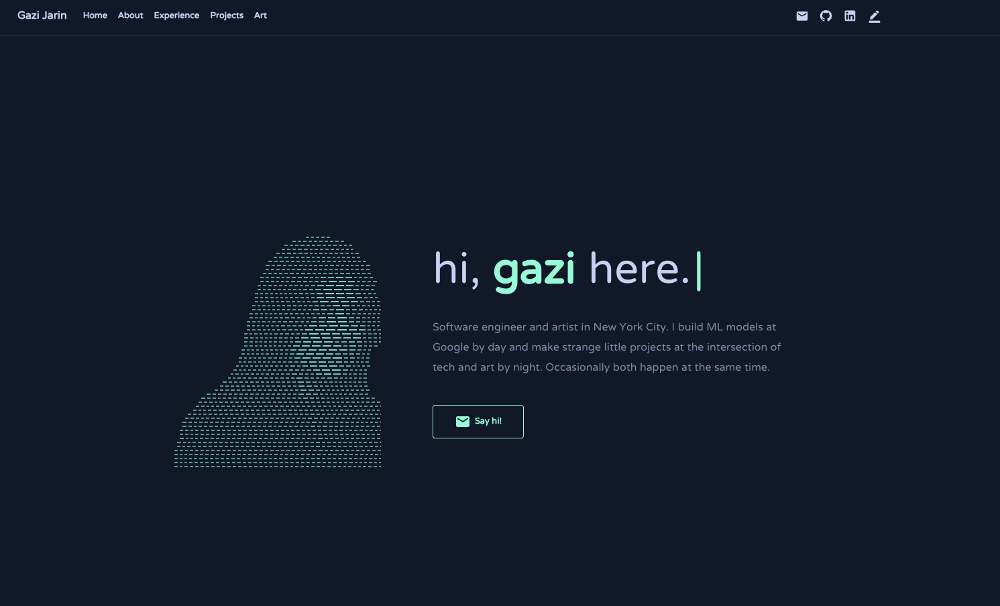

<p align="center">
  
</p>
<h1 align="center">
  Prajal Gautam - v2
</h1>
<p align="center">
  The second iteration of <a href="https://prajalgautam.com" target="_blank">prajalgautam.com</a> built with Vite and React 19, leveraging Material UI v6 and Bootstrap 5.
</p>
<p align="center">
  
</p>

## 🛠 set-up

1. Install the dependencies

   ```sh
   npm install
   ```

2. Start the development server

   ```sh
   npm run dev
   ```

## 🚀 build and run for production

1. Generate a full static production build

   ```sh
   npm run build
   ```


## 🎨 color codes

| Color          | Hex                                                                |
| -------------- | ------------------------------------------------------------------ |
| Navy           |  `#0a192f` |
| Light Navy     |  `#112240` |
| Lightest Navy  |  `#233554` |
| Slate          |  `#8892b0` |
| Light Slate    |  `#a8b2d1` |
| Lightest Slate |  `#ccd6f6` |
| White          |  `#e6f1ff` |
| Green          |  `#64ffda` |
